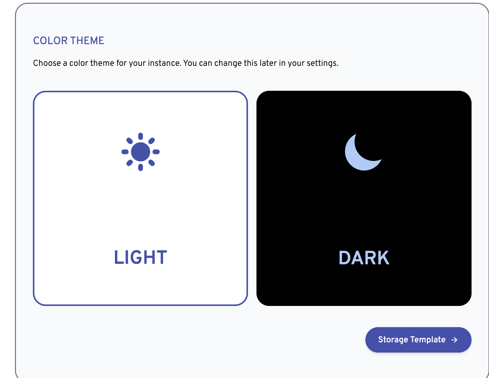
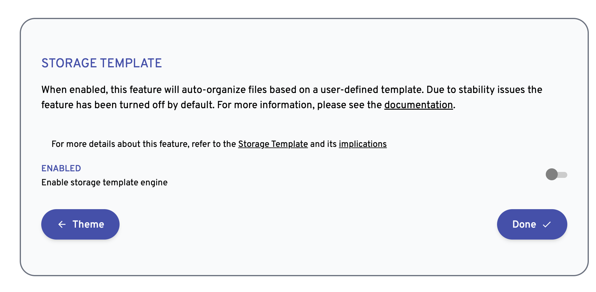
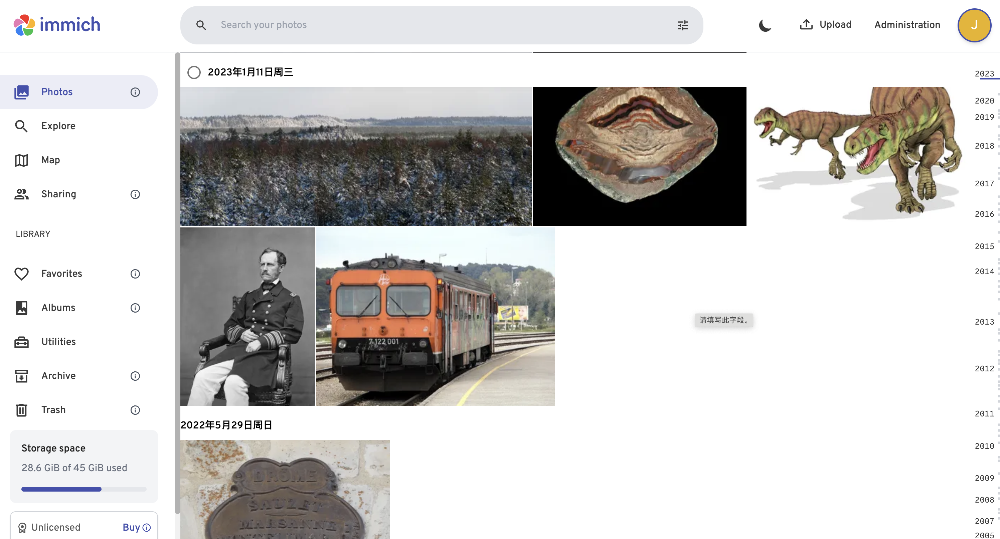
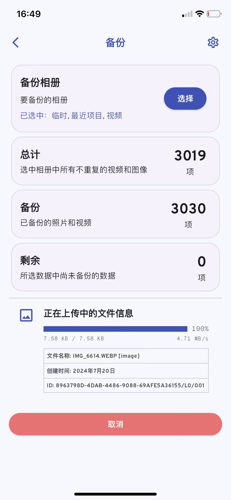

# Immich


这是一款非常优秀的私人相册管理工具，它支持一键部署到自己的私有系统中，并且具有手机端 APP （IOS系统）。

## 主要的功能
- 自动备份： 这个功能可以将手机里的照片和视频自动备份到私人服务器，不过这个功能之前一直有 BUG，直到最新的 1.106.4 才能够正常进行备份
- 时间线： 具有时间线功能，可按时间排版所有的照片，不过只能按天
- 搜索：自动进行照片分类，可按地点检索图片，目前好像不支持按人物检索照片
- 多用户： 支持基本的用户管理能力
- 共享相册：支持与其他用户共享相册，例如亲子相册，但是共享相册不支持时间线

## 安装
```
cd components/immich
docker compose up -d
```
图片的缓存目录在 `./library/upload/`

访问地址： `http://ipaddress:2283`


初始化管理员信息：






手机端下载 [Immich App](https://apps.apple.com/cn/app/immich/id1613945652) ，登录即可使用。

## 常见功能截图

web 版本管理界面：



手机端页面：



## 常见问题
### 错误的使用了 docker-compose 命令

```
docker-compose down
ERROR: The Compose file './docker-compose.yml' is invalid because:
'name' does not match any of the regexes: '^x-'

You might be seeing this error because you're using the wrong Compose file version. Either specify a supported version (e.g "2.2" or "3.3") and place your service definitions under the `services` key, or omit the `version` key and place your service definitions at the root of the file to use version 1.
For more on the Compose file format versions, see https://docs.docker.com/compose/compose-file/
```

使用一下命令替换：

```
docker compose down
docker compose up -d
```

## 总结

是个人试用过的最好用的图片和视频工具了，相比之前的 Piwigo 等，其流畅程度和成熟度都要更为优秀。例如 kodbox 这类网盘，在进行大批量的图片上传时就会卡死，Immich 不存在这个问题。